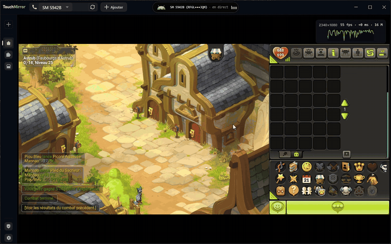
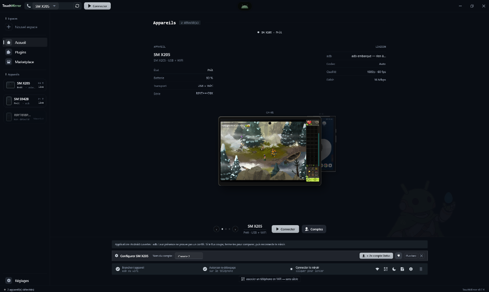
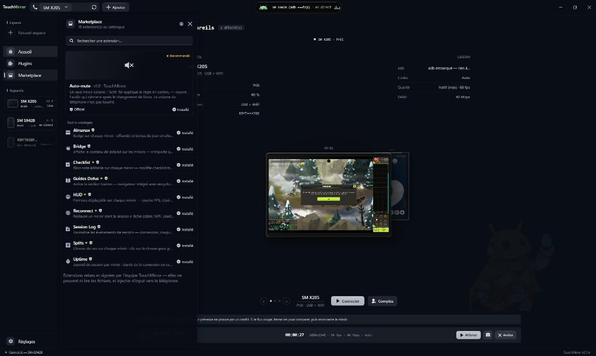
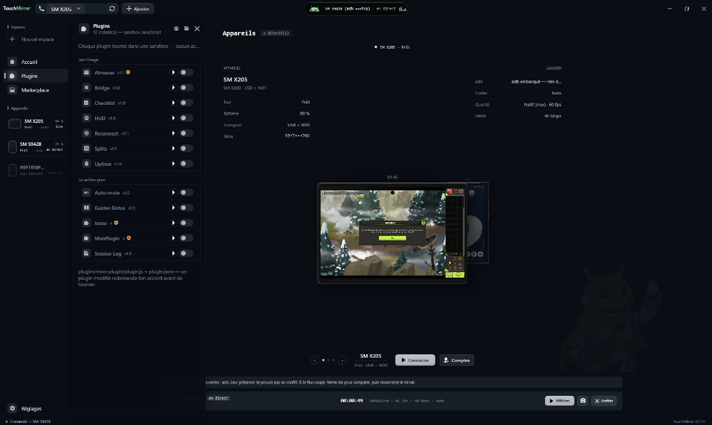

<a id="top"></a>

<div align="center">

### 🌐 [English version — click here](README.md)

</div>

> [!WARNING]
> **Attention aux copies** — le seul site officiel est **[touchmirror.xyz](https://www.touchmirror.xyz/)** et le seul dépôt officiel est **[github.com/shinzarou-eng/TouchMirror](https://github.com/shinzarou-eng/TouchMirror)**. Toute autre adresse (ex. domaines avec tiret) n'est pas affiliée au projet : ne télécharge l'app que depuis la page [Releases](https://github.com/shinzarou-eng/TouchMirror/releases).

---

<div align="center">


# TouchMirror

**Mirroring Android natif pour Windows — pensé pour Dofus Touch.** *(Android screen mirroring — mirror & control your phone on PC)*

Gratuit, open source, sans compte, sans pub.

[](https://github.com/shinzarou-eng/TouchMirror/releases/latest)
[](https://github.com/shinzarou-eng/TouchMirror/releases)
[](https://github.com/shinzarou-eng/TouchMirror/stargazers)
[](https://github.com/shinzarou-eng/TouchMirror/commits/main)
[](https://github.com/shinzarou-eng/TouchMirror)
[](https://dotnet.microsoft.com)
[](LICENSE)
[](#conformité-ankama)
[](https://www.dofus-touch.com)
[](https://discord.gg/DBJ9kNCdX)




**[Télécharger la dernière version](https://github.com/shinzarou-eng/TouchMirror/releases/latest)** · **[Site — touchmirror.xyz](https://www.touchmirror.xyz/)** · [Discord](https://discord.gg/DBJ9kNCdX) · [Documentation](docs/wiki/Home.md) · [Roadmap](ROADMAP.md) · [Signaler un bug](https://github.com/shinzarou-eng/TouchMirror/issues) · [Proposer une idée](https://github.com/shinzarou-eng/TouchMirror/issues/new)

🧪 **[On cherche des testeurs — rejoins le Discord](https://discord.gg/DBJ9kNCdX)** — bugs, idées, tests multi-téléphones : les retours de la communauté façonnent la roadmap.

</div>

---

<details>
<summary><b>Table des matières</b></summary>

[Pourquoi TouchMirror ?](#pourquoi-touchmirror-) · [Fonctionnalités](#fonctionnalités) · [Installation](#installation) · [Raccourcis plaqués](#raccourcis-plaqués) · [Affichage virtuel](#affichage-virtuel) · [Multicompte](#multicompte) · [Raccourcis clavier](#raccourcis-clavier) · [API locale](#api-locale-optionnelle) · [Build depuis les sources](#build-depuis-les-sources) · [Stack technique](#stack-technique) · [Conformité Ankama](#conformité-ankama) · [Roadmap](#roadmap) · [Participer](#participer) · [Licence](#licence)

</details>

## Pourquoi TouchMirror ?

TouchMirror est une application **Windows native** qui affiche et contrôle ton téléphone Android depuis le PC : tu branches, tu cliques, tu joues. Interface sombre soignée, faible latence, plusieurs téléphones dans **une seule fenêtre** — et un moteur de mirroring maison, fork de scrcpy-server, dont les sources sont dans `engine/`.

L'alternative open source à scrcpy pensée pour les joueurs : affiche et contrôle ton vrai téléphone, avec raccourcis, écrans virtuels et multicompte dans une seule fenêtre. Chaque ligne est lisible, les idées remontent sur Discord, et l'app n'appartient qu'à ceux qui l'utilisent.

## Fonctionnalités

**Miroir & contrôle**

| | | |
|---|---|---|
| 🎥 | **Mirroring HD** | Résolution native du téléphone, 60/90/120 fps, codecs H.264, H.265 et AV1 |
| ⚡ | **Faible latence** | Décodage FFmpeg basse latence, dernière frame prioritaire, audio ~400 ms, sockets optimisés |
| ⚙️ | **Pipeline GPU direct** | Chemin D3D11 maison : les frames NV12 décodées alimentent un pixel shader sur le GPU — sans readback CPU, sans copie côté UI |
| 🖱️ | **Souris = tactile** | Clic, glisser, molette = scroll, `Ctrl`+molette = pinch-to-zoom (zoom de la map) |
| ⌨️ | **Clavier** | Le texte tapé arrive sur le téléphone comme un clavier Bluetooth |
| 📋 | **Presse-papiers** | Bidirectionnel — `Ctrl`+`V` colle sur le tel, copier sur le tel arrive sur le PC |
| 🌙 | **Écran éteint** | L'écran physique du téléphone passe au noir pendant le mirroring — ménage la batterie et les dalles AMOLED |
| ⛶ | **Plein écran** | `F11` ou bouton dédié, barre de contrôle au survol du bord haut |
| 🎬 | **Mode capture** | Fenêtre propre pour OBS — idéal pour streamer |

**Plusieurs téléphones, une fenêtre**

| | | |
|---|---|---|
| 📱 | **Multicompte** | Plusieurs téléphones dans une seule fenêtre — ou un second compte sur le même téléphone via un profil Android |
| 🗂️ | **Espaces de travail** | « Solo », « Duo », « Stream » — appareils, ordre, miroir actif et réglages par appareil restaurés en un clic ; `Ctrl`+`Maj`+`1-9` pour basculer |
| 🔌 | **Détection instantanée** | `adb track-devices` événementiel — le téléphone apparaît dès le branchement, sans polling |
| � | **Reconnexion auto** | Une session qui lâche retente avec un budget borné et ne saute jamais sur un autre appareil — une déconnexion volontaire annule proprement |
| 🍃 | **Économie de ressources** | Les miroirs inactifs arrêtent de décoder la vidéo (CPU/GPU économisés) — l'enregistrement continue en arrière-plan |
| 🎨 | **Personnalisation** | Renomme chaque téléphone (tuiles + hub) et choisis sa couleur d'accent — clic droit sur l'appareil |
| 📶 | **USB & WiFi** | Appairage par QR code en un scan (Android 11+, jamais de câble) — ou bascule un appareil branché en sans-fil en un clic |

**Pensé pour les joueurs**

| | | |
|---|---|---|
| 🎯 | **Raccourcis plaqués** | Pose un repère sur un sort à l'écran, assigne une touche — 1 frappe = 1 tap à cet endroit. Style (pastille, cercle, minimal), opacité et taille réglables, sauvegardés par appareil. Manuel pur : pas de répétition, pas de macro |
| 🖥️ | **Affichage virtuel** | Dofus tourne sur un écran virtuel dédié — le téléphone physique reste libre. Presets paysage, portrait et **tablette** (8″/10″ : les apps passent en UI tablette) |
| 🎚️ | **Presets qualité** | Performance / Équilibré / Qualité+ / Maximal — résolution, fps et bitrate appliqués en un clic |
| ⏺️ | **Enregistrement MP4** | Remux sans ré-encodage — fichiers directement lisibles et uploadables |
| 📸 | **Captures PNG** | Un clic, enregistrées dans `Images\TouchMirror` |
| 📖 | **Aide intégrée** | Forum, encyclopédie et DofusDB dans un panneau navigateur sans quitter le jeu |

**Extensibilité & maintenance**

| | | |
|---|---|---|
| 🔗 | **API locale** | HTTP + SSE sur localhost avec token — pilotage Stream Deck, OBS, scripts. Pilote l'app seulement : connexion, enregistrement, capture — aucun endpoint n'envoie de tactile ou de touches au jeu |
| 🧩 | **Plugins** | Moteur JavaScript embarqué (sandbox) — manifest `plugin.json`, plugins officiels vérifiés par hash |
| 🩺 | **Diagnostics intégrés** | Panneau complet : score de santé, rapport copiable (version masquée dispo), réparations en un clic (adb, pare-feu, RSA), benchmark 30 s et test WiFi — guides par marque (Xiaomi, Samsung, Oppo, Vivo, Huawei) |
| �️ | **Pare-feu automatique** | La règle entrante est créée quand tu actives le mirroring AirPlay — une seule invite UAC, limitée à ton réseau local |
| ⬆️ | **Mises à jour auto** | Avec le Setup : chaque nouvelle version est détectée au démarrage, téléchargée en delta (seul le diff) et appliquée au redémarrage — plus rien à retélécharger à la main |
| 🍎 | **iPhone / AirPlay** (*bêta*) | Miroir d’un iPhone/iPad en Wi-Fi — l’app héberge un récepteur AirPlay local. *Pas encore dans le zip GitHub — builds locales uniquement* · [état d'avancement](docs/airplay.md) |

## Installation

> [!TIP]
> **Installe une fois, à jour pour toujours.** Avec `TouchMirror-win-Setup.exe`, l'app se met à jour toute seule : nouvelle version détectée au démarrage, téléchargée en **delta** — seuls les fichiers modifiés (v0.8.1 → v0.8.2 : **2,5 Mo** au lieu de ~180 Mo) — puis appliquée au redémarrage. Plus rien à chercher sur GitHub, plus rien à réinstaller.

### Version prête à l'emploi (recommandé)

**Installateur — mises à jour automatiques :**

1. Télécharge **`TouchMirror-win-Setup.exe`** depuis la [dernière release](https://github.com/shinzarou-eng/TouchMirror/releases/latest)
2. Lance-le une fois — ensuite l'app se met à jour toute seule : nouvelle version détectée au démarrage, **delta** téléchargé, redémarrage et c'est à jour

**Portable (zip) — sans installation :**

1. Télécharge **`TouchMirror-win-x64.zip`**, dézippe où tu veux, lance **`TouchMirror.exe`**
2. **adb est embarqué**, le runtime .NET est inclus et FFmpeg s'extrait au premier lancement — les màj se font en re-téléchargeant le zip (la bannière ouvre la release)

### Configuration du téléphone

1. **Options développeur → Débogage USB** activé
2. Branche en USB, accepte l'autorisation sur le téléphone
3. Clique **Connecter** — le miroir s'affiche, tu joues depuis le PC

### Mode WiFi

Deux façons de passer en sans-fil — PC et téléphone sur le même réseau :

- **Appairage par QR (Android 11+, jamais de câble)** — icône d'association dans le hub : scanne le QR depuis *Débogage sans fil → Associer via QR code* sur le téléphone et il apparaît tout seul dans la liste. L'appairage reste enregistré — le téléphone se reconnecte automatiquement sur le même réseau jusqu'à révocation. Saisie manuelle `ip:port` + code et un chemin « déjà associé → connecter » servent de secours.
- **Depuis un appareil branché** — menu **⋯ → Activer le WiFi** bascule l'appareil en TCP/IP ; débranche le câble, le flux continue. *(À refaire après un redémarrage du téléphone — limitation Android.)*

## Raccourcis plaqués

Une touche clavier qui tape à un endroit précis de l'écran — pour les sorts, les items, les boutons :

1. Active **⌨ Raccourcis** dans la barre d'outils
2. Clique sur un sort à l'écran → un repère apparaît
3. Appuie sur une touche (`1`, `A`, `F1`…) → le repère prend le nom de la touche
4. Quitte le mode édition → chaque frappe envoie **un** tap à cet endroit

En mode édition : glisser pour déplacer, clic droit pour supprimer, `Échap` pour quitter. Style, opacité et taille se règlent dans le panneau en haut de la vidéo. Les positions sont relatives à l'image — elles survivent au redimensionnement, à la rotation et à l'affichage virtuel.

**Strictement manuel :** 1 frappe = 1 tap, maintenir la touche ne répète rien. C'est un raccourci ergonomique, pas une automatisation.

## Affichage virtuel

Réglages → **VIDÉO → Écran** : au lieu de l'écran physique, le miroir affiche un écran virtuel Android dédié (Android 10+) :

- **Dofus tourne dans le virtuel** — tu peux utiliser ton téléphone normalement en parallèle
- Presets **paysage** (1080p/900p/720p), **portrait** (1080×1920) et **tablette** (1920×1200, 2560×1600)
- Les presets tablette baissent la densité → les apps passent en interface tablette (HUD plus aéré)

## Multicompte

Autorisé par Ankama : autant d'appareils physiques que tu veux, un compte par téléphone.

1. Connecte le premier téléphone
2. Branche le deuxième → il apparaît dans la liste → **Connecter**
3. Clique une miniature pour la cibler — seule la tuile active reçoit les actions et sort le son ; les inactives arrêtent de décoder pour économiser le CPU
4. Au clavier : `Ctrl`+`Tab` pour cycler, `Ctrl`+`1…9` pour viser directement

### Deuxième compte sur le même téléphone

TouchMirror peut aussi créer un **profil Android secondaire** depuis l'app — le téléphone fait alors tourner Dofus Touch deux fois, chaque compte sur son propre écran virtuel et sa propre tuile :



1. Menu de l'appareil → **Comptes → Nouveau compte Dofus…**
2. TouchMirror crée le profil, y installe le jeu existant et le démarre — pas besoin de Samsung Dual Apps ni de Secure Folder
3. Le clone a son propre écran virtuel et sa propre tuile miroir (ex. `Mon tel · Compte 2`)
4. Une seule tuile active à la fois : les clics et les touches n'atteignent que le miroir sélectionné — rien n'est jamais répliqué entre les comptes

## Raccourcis clavier

| Touche | Action |
|---|---|
| `F11` | Plein écran |
| `Échap` | Ferme ce qui est ouvert — confirmation, panneau latéral, hub, plein écran |
| `Ctrl` + `Tab` | Miroir suivant / précédent (`+Shift`) |
| `Ctrl` + `1…9` | Activer directement le miroir N |
| `Ctrl` + `Maj` + `1…9` | Basculer vers l'espace de travail N |
| `Ctrl` + `V` | Colle le presse-papiers du PC sur le téléphone |
| `Ctrl` + molette | Zoom (pinch) |
| Touche assignée | Tap au repère plaqué (raccourcis plaqués) |
| Souris sur la vidéo | Tactile direct — aucun raccourci caché qui interfère avec le jeu |

## API locale (optionnelle)

Réglages → **API locale** : expose `http://127.0.0.1:<port>` protégé par token (`Authorization: Bearer <token>` ou `?token=`).

| Endpoint | Effet |
|---|---|
| `GET /api/status` · `/api/mirrors` · `/api/devices` | État de l'app, tuiles et appareils |
| `POST /api/mirrors/{n}/activate` | Changer de miroir (= `Ctrl`+N) |
| `POST /api/mirrors/{n}/record` · `/screenshot` · `/disconnect` | Actions par tuile |
| `POST /api/devices/{serial}/connect` | Connecter un appareil |
| `GET /api/events` | Flux SSE temps réel (connexions, tuile active, REC…) |

**Conformité :** l'API pilote l'app, jamais le jeu — aucun endpoint n'envoie de tactile, de touches ou de presse-papiers au téléphone. `connect` peut réveiller l'écran et lancer l'app configurée, comme un branchement manuel.

### Plugins

<p>


</p>

Panneau **🧩 Plugins** dans la barre latérale : un plugin = un dossier `plugins/<nom>/` avec un manifest `plugin.json` (nom, version, description) et un `plugin.js`. Le code tourne dans un **moteur JavaScript embarqué et sandboxé** — pas de process externe, pas de shell : le plugin ne voit que l'objet `tm`.

```text
plugins/
  reconnect/
    plugin.json    # métadonnées (nom, version, auteur…)
    plugin.js      # logique, via l'API tm.*
```

**API exposée** (`tm.*`, control-plane uniquement) :

```javascript
await tm.getDevices();           // appareils découverts
await tm.getMirrors();           // miroirs et leurs slots
await tm.connect("RFGL22M2JQM"); // connecter un appareil
await tm.activate(0);            // slot 0 en grand miroir
await tm.screenshot(0);          // capture
await tm.mute(1, true);          // coupe l'audio local du miroir
                                 // (le volume du téléphone n'est pas touché)
tm.overlay(1, { visible: true, title: "FPS", color: "#3ECF8E",
                pos: "bl", compact: false });
                                 // widget déplaçable sur le miroir —
                                 // pos : tl/tr/bl/br, compact : valeur seule
tm.overlay(1, { compact: true, lines: ["☐ tâche a", "☑ tâche b"] });
                                 // liste de lignes cliquables — un clic émet
                                 // « overlay.line » { slot, id, index }
tm.push(1, 60);                  // ajoute un point à la courbe
tm.push(1, { value: 60, label: "60 fps" });
                                 // libellé libre au lieu du nombre
                                 // un widget par plugin (option "id" pour plus)
tm.on("devices", e => …);        // événements temps réel — aussi mirror.active,
                                 // mirror.connected, mirror.disconnected,
                                 // mirror.recording, overlay.line
tm.setInterval(fn, ms); tm.setTimeout(fn, ms);
tm.read("checklist.txt");        // lit un fichier dans le dossier du plugin
tm.write("state.json", "{}");    // et peut y écrire — extensions data seulement
tm.log("message");               // → journal de l'app
```

Aucun accès réseau ou processus depuis le sandbox — et comme l'API locale, **rien ne peut envoyer de tactile ou de touches au jeu**. Les fichiers sont confinés au dossier du plugin (`.txt`/`.json`/`.csv`… données seulement, jamais de code). Le moteur est borné (mémoire, récursion, timers, 30 appels/s max) et chaque action d'un plugin est tracée dans le journal.

Un plugin est du code : n'installe que ce que tu lis ou qui vient de nous. Les plugins officiels portent un badge bouclier vert (hash SHA-256 vérifié) — tout autre plugin demande une confirmation avant activation, et toute modification d'un plugin déjà approuvé redemande ton accord. Les plugins pilotent l'app — jamais le jeu.

Inclus : **Reconnect** — restaure un miroir dont la session a lâché (câble, WiFi, plantage), jamais après une déconnexion volontaire. La farm se répare seule, sans rien lancer sur le téléphone.

## Build depuis les sources

```bash
dotnet build src/AndroidMirror/TouchMirror.csproj
```

Prérequis : **.NET 10 SDK** uniquement — adb, le moteur TouchMirror (`assets/touchmirror-engine.jar`) et les DLLs FFmpeg sont embarqués dans le repo. Les sources du moteur (fork de scrcpy-server, Apache-2.0) sont dans `engine/` — rebuild via `engine/build-engine.ps1`.

## Stack technique

WPF / .NET 10 · WPF-UI · moteur TouchMirror (fork scrcpy-server) · pipeline D3D11 maison (`GpuPresenter` — slices NV12 → pixel shader → texture D3D9 partagée) · FFmpeg (décodage + remux MP4) · NAudio · WebView2

## Conformité Ankama

**La différence qui change tout.** Un émulateur (BlueStacks, LDPlayer…) fait tourner le jeu *sur le PC* dans un appareil virtuel — interdit quelle que soit la façon de jouer. TouchMirror ne fait rien tourner : le jeu officiel reste sur ton **vrai téléphone**, on ne fait qu'afficher et contrôler son écran. Le mirroring est explicitement autorisé dans la [FAQ officielle](https://support.ankama.com/hc/fr/articles/26840828168209) — au même titre que la souris et le clavier Bluetooth.

Les raccourcis plaqués produisent exactement la même entrée qu'une souris Bluetooth : **1 frappe = 1 tap**, un événement tactile normal pour le jeu — pas de répétition, pas de macro, rien qui ne parte de ton geste.

**TouchMirror ne proposera jamais de système d'automatisation, de bot ou de macro** — ni aujourd'hui, ni dans une version future. L'API locale et les plugins pilotent l'application (miroir, capture, enregistrement, reconnexion), jamais les actions en jeu : aucune route API n'envoie de tactile, de clavier, de texte ou de presse-papiers vers Android. Une connexion via API/plugin peut lancer l'app configurée ou réveiller l'écran — ce qu'un humain fait en branchant le câble. Voir le [hors périmètre de la roadmap](ROADMAP.md#hors-périmètre).

**Multicompte en JcJ** — Ankama limite à **2 comptes** certains combats (île de l'Ascension, percepteur, prisme, kolizéum, AvA). L'app affiche tous tes téléphones ; respecter cette limite dans ces combats reste ta responsabilité.

## Roadmap

Prochaines étapes : support Linux, sortie audio par appareil, et polish continu de l'expérience multi-téléphones.

**[Consulter la roadmap](ROADMAP.md)** — priorités, critères de validation et pistes à l'étude. Les éléments prévus ne sont pas encore des fonctionnalités disponibles.

## Participer

| | |
|---|---|
| 💬 **[Discord](https://discord.gg/DBJ9kNCdX)** | Questions, retours, entraide multicompte — la communauté est là |
| 🐛 **[Issues GitHub](https://github.com/shinzarou-eng/TouchMirror/issues)** | Bugs et idées de fonctionnalités |
| ⭐ **[Star le repo](https://github.com/shinzarou-eng/TouchMirror)** | Gratuit, une seconde, et ça aide le projet à se faire connaître |
| 🧩 **Plugins** | Écris ton propre overlay ou outil — voir l'API `tm.*` plus haut |

## Licence

[MIT](LICENSE) — libre d'utilisation, de modification et de redistribution. Le moteur dans `engine/` est sous Apache-2.0 (fork de scrcpy-server).

---

<div align="center">
Fait avec ❤️ pour la communauté Dofus Touch

**[⬆ Retour en haut](#top)**
</div>
