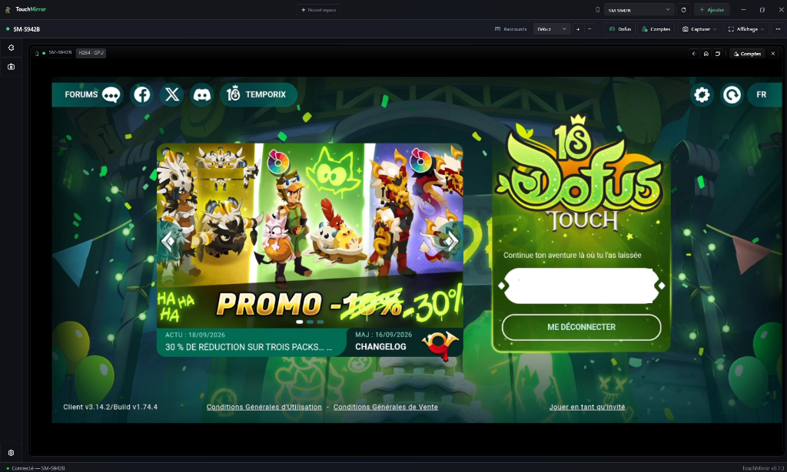

<a id="top"></a>

<div align="center">

## 🇫🇷 [LIRE EN FRANÇAIS — CLIQUEZ ICI](README.fr.md)

</div>

<div align="center">


# TouchMirror

**Native Android screen mirroring for Windows — built for Dofus Touch.**

Free, open source, no account, no ads.

[](https://github.com/shinzarou-eng/TouchMirror/releases/latest)
[](https://github.com/shinzarou-eng/TouchMirror/releases)
[](https://github.com/shinzarou-eng/TouchMirror/stargazers)
[](https://github.com/shinzarou-eng/TouchMirror/commits/main)
[](https://github.com/shinzarou-eng/TouchMirror)
[](https://dotnet.microsoft.com)
[](LICENSE)
[](#ankama-compliance)
[](https://www.dofus-touch.com)
[](https://discord.gg/DBJ9kNCdX)


**[Download the latest release](https://github.com/shinzarou-eng/TouchMirror/releases/latest)** · **[Site — touchmirror.xyz](https://www.touchmirror.xyz/)** · [Discord](https://discord.gg/DBJ9kNCdX) · [Documentation](docs/wiki/Home.md) · [Roadmap](ROADMAP.md) · [Report a bug](https://github.com/shinzarou-eng/TouchMirror/issues) · [Suggest a feature](https://github.com/shinzarou-eng/TouchMirror/issues/new)

🧪 **[Looking for testers — join the Discord](https://discord.gg/DBJ9kNCdX)** — bugs, ideas, multi-phone testing: community feedback shapes the roadmap.

</div>

> [!WARNING]
> **Beware of copies** — the only official website is **[touchmirror.xyz](https://www.touchmirror.xyz/)** and the only official repository is **[github.com/shinzarou-eng/TouchMirror](https://github.com/shinzarou-eng/TouchMirror)**. Any other address (e.g. hyphenated domains) is not affiliated with the project: only download the app from the [Releases](https://github.com/shinzarou-eng/TouchMirror/releases) page.

---

<details>
<summary><b>Table of contents</b></summary>

[Why TouchMirror?](#why-touchmirror) · [Features](#features) · [Installation](#installation) · [On-screen keybinds](#on-screen-keybinds) · [Virtual display](#virtual-display) · [Multi-account](#multi-account) · [Keyboard shortcuts](#keyboard-shortcuts) · [Local API](#local-api-optional) · [Build from source](#build-from-source) · [Tech stack](#tech-stack) · [Ankama compliance](#ankama-compliance) · [Roadmap](#roadmap) · [Get involved](#get-involved) · [License](#license)

</details>

## Why TouchMirror?

TouchMirror is a **native Windows app** that displays and controls your Android phone from your PC: plug it in, click, play. Polished dark UI, low latency, multiple phones in **a single window** — powered by our own mirroring engine, a scrcpy-server fork whose sources live in `engine/`.

Think of it as an open-source scrcpy alternative made for players: mirror and control your real phone, with keybinds, virtual displays and multi-account in one window. Every line is readable, ideas are shared on Discord, and the app belongs to the people who use it.

## Features

**Mirror & control**

| | | |
|---|---|---|
| 🎥 | **HD mirroring** | Native phone resolution, 60/90/120 fps, H.264, H.265 and AV1 codecs |
| ⚡ | **Low latency** | Low-latency FFmpeg decoding, latest-frame priority, ~400 ms audio, optimized sockets |
| ⚙️ | **Direct GPU pipeline** | Custom D3D11 path: decoded NV12 frames feed a pixel shader on the GPU — no CPU readback, no UI-thread copy |
| 🖱️ | **Mouse = touch** | Click, drag, wheel = scroll, `Ctrl`+wheel = pinch-to-zoom (map zoom) |
| ⌨️ | **Keyboard** | Typed text reaches the phone like a Bluetooth keyboard |
| 📋 | **Clipboard** | Bidirectional — `Ctrl`+`V` pastes to the phone, copying on the phone reaches the PC |
| 🌙 | **Screen off** | The phone's physical display goes dark while mirroring — saves battery, protects AMOLED panels |
| ⛶ | **Fullscreen** | `F11` or dedicated button, control bar appears at the top edge |
| 🎬 | **Capture mode** | Clean window for OBS — ideal for streaming |

**Multiple phones, one window**

| | | |
|---|---|---|
| 📱 | **Multi-account** | Several phones in one window — or a second account on the same phone via an Android profile |
| 🗂️ | **Workspaces** | "Solo", "Duo", "Stream" — devices, order, active mirror and per-device settings restored in one click; `Ctrl`+`Shift`+`1-9` to switch |
| 🔌 | **Instant detection** | Event-driven `adb track-devices` — the phone shows up as soon as it's plugged in, no polling |
| � | **Auto-reconnect** | A dropped session retries with a bounded budget and never jumps to another device — a voluntary disconnect cancels cleanly |
| 🍃 | **Resource saver** | Inactive mirrors stop decoding video (CPU/GPU saved) — recording keeps running in the background |
| 🎨 | **Customization** | Rename each phone (tiles + hub) and pick its accent color — right-click the device |
| 📶 | **USB & WiFi** | QR pairing in one scan (Android 11+, no cable ever) — or switch a plugged device to wireless in one click |

**Built for players**

| | | |
|---|---|---|
| 🎯 | **On-screen keybinds** | Drop a marker on a spell, bind a key — 1 keypress = 1 tap at that spot. Adjustable style (pill, circle, minimal), opacity and size, saved per device. Fully manual: no repeat, no macros |
| 🖥️ | **Virtual display** | The game runs on a dedicated virtual screen — the physical phone stays free. Landscape, portrait and **tablet** presets (apps switch to tablet UI) |
| 🎚️ | **Quality presets** | Performance / Balanced / Quality+ / Max — resolution, fps and bitrate applied in one click |
| ⏺️ | **MP4 recording** | Remux with no re-encode — files ready to play and upload |
| 📸 | **PNG screenshots** | One click, saved to `Pictures\TouchMirror` |
| 📖 | **Built-in help** | Forum, encyclopedia and DofusDB in a browser panel without leaving the game |

**Extensibility & ops**

| | | |
|---|---|---|
| 🔗 | **Local API** | HTTP + SSE on localhost with a token — Stream Deck, OBS, scripts. Drives the app only: connect/disconnect, record, screenshot — no endpoint can send touch or keys into the game |
| 🧩 | **Plugins** | Embedded JavaScript engine (sandbox) — `plugin.json` manifest, official plugins verified by hash |
| 🩺 | **Built-in diagnostics** | Full panel: health score, copyable report (masked variant available), one-click repairs (adb, firewall, RSA), 30 s benchmark and WiFi test — per-brand guides (Xiaomi, Samsung, Oppo, Vivo, Huawei) |
| �️ | **Automatic firewall** | The inbound rule is created when you enable AirPlay mirroring — a single UAC prompt, restricted to your local network |
| ⬆️ | **Auto-updates** | With the Setup build: each new release is detected at startup, downloaded as a delta (only what changed) and applied on restart — never download by hand again |
| 🍎 | **iPhone / AirPlay** (*beta*) | Mirror an iPhone/iPad over Wi-Fi — the app hosts a local AirPlay receiver. *Not yet bundled in the GitHub zip — local builds only* · [progress notes](docs/airplay.md) |

## Installation

> [!TIP]
> **Install once, always up to date.** With `TouchMirror-win-Setup.exe`, the app updates itself: new releases are detected at startup, downloaded as **deltas** — only changed files (v0.8.1 → v0.8.2: **2.5 MB** instead of ~180 MB) — then applied on restart. Nothing to fetch from GitHub, nothing to reinstall.

### Ready-to-use build (recommended)

> **Note:** the app is bilingual FR/EN — pick your language in *Settings → Language*. Strings live in `lang/en.json` and `lang/fr.json`.

**Installer — automatic updates:**

1. Download **`TouchMirror-win-Setup.exe`** from the [latest release](https://github.com/shinzarou-eng/TouchMirror/releases/latest)
2. Run it once — from then on the app updates itself: new version detected at startup, **delta** downloaded, restart and you're up to date

**Portable (zip) — no install:**

1. Download **`TouchMirror-win-x64.zip`**, unzip anywhere, run **`TouchMirror.exe`**
2. **adb is bundled**, the .NET runtime is included and FFmpeg extracts on first launch — updates mean re-downloading the zip (the banner opens the release)

### Phone setup

1. **Developer options → USB debugging** enabled
2. Plug in via USB, accept the authorization on the phone
3. Click **Connect** — the mirror shows up, you play from the PC

### WiFi mode

Two ways to go wireless — PC and phone on the same network:

- **QR pairing (Android 11+, no cable at all)** — pair icon in the hub: scan the QR from *Wireless debugging → Pair via QR code* on the phone and it shows up in the list on its own. Pairing is remembered — the phone auto-reconnects on the same network until you revoke it. Manual `ip:port` + code entry and a "already paired → connect" path are there as fallback.
- **From a plugged-in device** — menu **⋯ → Enable WiFi** switches the device to TCP/IP; unplug the cable, the stream keeps going. *(Must be redone after a phone reboot — Android limitation.)*

## On-screen keybinds

A keyboard key that taps a precise spot on screen — for spells, items, buttons:

1. Enable **⌨ Keybinds** in the toolbar
2. Click on a spell on screen → a marker appears
3. Press a key (`1`, `A`, `F1`…) → the marker takes the key's name
4. Exit edit mode → each keypress sends **one** tap at that spot

In edit mode: drag to move, right-click to delete, `Esc` to quit. Style, opacity and size are set in the panel at the top of the video. Positions are relative to the image — they survive window resizing, rotation and virtual display.

**Strictly manual:** 1 keypress = 1 tap, holding the key repeats nothing. It's an ergonomic shortcut, not automation.

## Virtual display

Settings → **VIDEO → Display**: instead of the physical screen, the mirror shows a dedicated Android virtual display (Android 10+):

- **The game runs in the virtual display** — you can use your phone normally at the same time
- **Landscape** presets (1080p/900p/720p), **portrait** (1080×1920) and **tablet** (1920×1200, 2560×1600)
- Tablet presets lower the density → apps switch to tablet UI (roomier HUD)

## Multi-account

Allowed by Ankama: as many physical devices as you want, one account per phone.

1. Connect the first phone
2. Plug in the second → it shows up in the list → **Connect**
3. Click a thumbnail to target it — only the active tile receives actions and plays audio; inactive ones stop decoding to save CPU
4. From the keyboard: `Ctrl`+`Tab` to cycle, `Ctrl`+`1…9` to target directly

<div align="center">

</div>

### Second account on the same phone

TouchMirror can also create a **secondary Android profile** from the app — the phone then runs Dofus Touch twice, each account on its own virtual display and mirror tile:


1. Device menu → **Accounts → New Dofus account…**
2. TouchMirror creates the profile, installs the existing game into it and starts it — no Samsung Dual Apps or Secure Folder required
3. The clone gets its own virtual display and mirror tile (e.g. `My Phone · Account 2`)
4. One tile is active at a time: clicks and keys only ever reach the selected mirror — nothing is replicated between accounts

## Keyboard shortcuts

| Key | Action |
|---|---|
| `F11` | Fullscreen |
| `Esc` | Close what's open — dialog, side panel, mirror hub, fullscreen |
| `Ctrl` + `Tab` | Next / previous mirror (`+Shift`) |
| `Ctrl` + `1…9` | Activate mirror N directly |
| `Ctrl` + `Shift` + `1…9` | Switch to workspace N |
| `Ctrl` + `V` | Paste the PC clipboard onto the phone |
| `Ctrl` + wheel | Pinch zoom |
| Assigned key | Tap at the on-screen marker (keybinds) |
| Mouse on the video | Direct touch — no hidden shortcuts interfering with the game |

## Local API (optional)

Settings → **Local API**: exposes `http://127.0.0.1:<port>` protected by a token (`Authorization: Bearer <token>` or `?token=`).

| Endpoint | Effect |
|---|---|
| `GET /api/status` · `/api/mirrors` · `/api/devices` | App state, tiles and devices |
| `POST /api/mirrors/{n}/activate` | Switch mirror (= `Ctrl`+N) |
| `POST /api/mirrors/{n}/record` · `/screenshot` · `/disconnect` | Per-tile actions |
| `POST /api/devices/{serial}/connect` | Connect a device |
| `GET /api/events` | Real-time SSE stream (connections, active tile, REC…) |

**Compliance:** the API drives the app, never the game — no endpoint sends touch, keys or clipboard to the phone. `connect` can wake the screen and launch the configured app, the same as a manual plug-in.

### Plugins

<p>


</p>

**🧩 Plugins** panel in the side rail: a plugin = a `plugins/<name>/` folder with a `plugin.json` manifest (name, version, description) and a `plugin.js`. Code runs in an **embedded, sandboxed JavaScript engine** — no external process, no shell: the plugin only sees the `tm` object.

```text
plugins/
  reconnect/
    plugin.json    # metadata (name, version, author…)
    plugin.js      # logic, via the tm.* API
```

**Exposed API** (`tm.*`, control-plane only):

```javascript
await tm.getDevices();           // discovered devices
await tm.getMirrors();           // mirrors and their slots
await tm.connect("RFGL22M2JQM"); // connect a device
await tm.activate(0);            // slot 0 as the main mirror
await tm.screenshot(0);          // capture
await tm.mute(1, true);          // mute the mirror's local audio
                                 // (phone volume untouched)
tm.overlay(1, { visible: true, title: "FPS", color: "#3ECF8E",
                pos: "bl", compact: false });
                                 // draggable widget on the mirror —
                                 // pos: tl/tr/bl/br, compact: value only
tm.overlay(1, { compact: true, lines: ["☐ task a", "☑ task b"] });
                                 // clickable text list — a click emits
                                 // "overlay.line" { slot, id, index }
tm.push(1, 60);                  // append a point to its curve
tm.push(1, { value: 60, label: "60 fps" });
                                 // custom label instead of raw number
                                 // one widget per plugin (option "id" for more)
tm.on("devices", e => …);        // real-time events — also mirror.active,
                                 // mirror.connected, mirror.disconnected,
                                 // mirror.recording, overlay.line
tm.setInterval(fn, ms); tm.setTimeout(fn, ms);
tm.read("checklist.txt");        // read a file in the plugin's own folder
tm.write("state.json", "{}");    // write there too — data extensions only
tm.log("message");               // → app log
```

No network or process access from the sandbox — and like the local API, **nothing can inject input toward the phone**. File I/O is confined to the plugin's own folder (`.txt`/`.json`/`.csv`… data only, never code). The engine is bounded (memory, recursion, timers, 30 calls/s max) and every plugin action is logged.

A plugin is code: only install what you can read or what comes from us. Official plugins carry a green shield badge (SHA-256 verified hash) — any other plugin asks for confirmation before activation, and any change to an approved plugin requires your consent again. Plugins drive the app — never the game.

Included: **Reconnect** — restores a mirror whose session dropped (cable, WiFi, crash), never after a voluntary disconnect. The farm repairs itself without launching anything on the phone.

## Build from source

```bash
dotnet build src/AndroidMirror/TouchMirror.csproj
```

Requirements: **.NET 10 SDK** only — adb, the TouchMirror engine (`assets/touchmirror-engine.jar`) and the FFmpeg DLLs are bundled in the repo. Engine sources (scrcpy-server fork, Apache-2.0) live in `engine/` — rebuild via `engine/build-engine.ps1`.

## Tech stack

WPF / .NET 10 · WPF-UI · TouchMirror engine (scrcpy-server fork) · custom D3D11 pipeline (`GpuPresenter` — NV12 slices → pixel shader → shared D3D9 texture) · FFmpeg (decode + MP4 remux) · NAudio · WebView2

## Ankama compliance

**The difference that matters.** An emulator (BlueStacks, LDPlayer…) runs the game *on the PC* inside a virtual device — banned no matter how you play. TouchMirror runs nothing: the official game stays on your **real phone**, we only display and control its screen. Mirroring is explicitly allowed in the [official FAQ](https://support.ankama.com/hc/en-us/articles/26840828168209) — same as Bluetooth mice and keyboards.

On-screen keybinds produce the exact same input a Bluetooth mouse does: **1 keypress = 1 tap**, a normal touch event for the game — no repetition, no macro, nothing that doesn't come from your hand.

**TouchMirror will never offer automation, bots or macros** — not today, not in a future version. The local API and plugins drive the application (mirroring, capture, recording, reconnect), never in-game actions: no API route sends touch, keyboard input, text or clipboard toward Android. Connecting via API/plugin may start the configured app or wake the screen — the same thing a human does when plugging in. See the [roadmap out-of-scope section](ROADMAP.md).

**Multi-account in PvP** — Ankama caps you at **2 accounts** in some fights (Ascension Island, perceptor, prism, Kolossium, AvA). The app shows all your phones; respecting that cap in those fights is on you.

## Roadmap

Next steps: Linux support, per-device audio output, and continued polish of the multi-phone experience.

**[Read the roadmap](ROADMAP.md)** — priorities, validation criteria and ideas under study. Planned items are not available features yet.

## Get involved

| | |
|---|---|
| 💬 **[Discord](https://discord.gg/DBJ9kNCdX)** | Questions, feedback, multi-account help — the community lives here |
| 🐛 **[GitHub issues](https://github.com/shinzarou-eng/TouchMirror/issues)** | Bug reports and feature ideas |
| ⭐ **[Star the repo](https://github.com/shinzarou-eng/TouchMirror)** | Free, takes one second, and helps the project get noticed |
| 🧩 **Plugins** | Write your own overlay or tool — see the `tm.*` API above |

## License

[MIT](LICENSE) — free to use, modify and redistribute. The engine in `engine/` is Apache-2.0 (scrcpy-server fork).

---

<div align="center">
Made with ❤️ for the Dofus Touch community

**[⬆ Back to top](#top)**
</div>
