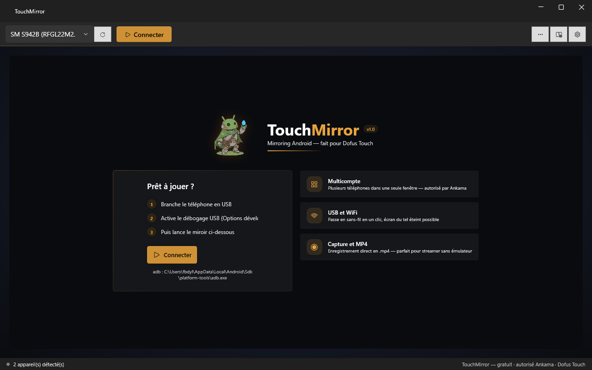

<div align="center">


# TouchMirror

**Mirroring Android natif pour Windows — pensé pour Dofus Touch.**

Gratuit, open source, sans compte, sans pub.

[](https://github.com/shinzarou-eng/TouchMirror/releases/latest)
[](https://github.com/shinzarou-eng/TouchMirror)
[](https://dotnet.microsoft.com)
[](LICENSE)
[](https://www.dofus-touch.com)
[](https://discord.gg/DBJ9kNCdX)



**[Télécharger la dernière version](https://github.com/shinzarou-eng/TouchMirror/releases/latest)** · [Discord](https://discord.gg/DBJ9kNCdX) · [Documentation](docs/wiki/Home.md) · [Signaler un bug](https://github.com/shinzarou-eng/TouchMirror/issues) · [Proposer une idée](https://github.com/shinzarou-eng/TouchMirror/issues/new)

</div>

---

## Pourquoi TouchMirror ?

scrcpy est puissant mais n'a pas d'interface. Vysor facture la HD. Aucun ne gère proprement plusieurs téléphones.

TouchMirror est une application **Windows native** qui affiche et contrôle ton téléphone Android depuis le PC : tu branches, tu cliques, tu joues. Interface sombre soignée, faible latence, et une grille multicompte — plusieurs téléphones dans **une seule fenêtre**.

## Fonctionnalités

| | |
|---|---|
| **Mirroring HD** | Résolution native du téléphone, 60/90/120 fps, codecs H.264, H.265 et AV1 |
| **Faible latence** | Décodage FFmpeg basse latence, dernière frame prioritaire, audio ~400 ms, sockets optimisés |
| **Multicompte** | Plusieurs téléphones dans une seule fenêtre, en grille adaptative — un compte par téléphone |
| **USB & WiFi** | Bascule en sans-fil en un clic, puis débranche le câble — le flux continue |
| **Souris = tactile** | Clic, glisser, molette = scroll, `Ctrl`+molette = pinch-to-zoom (zoom de la map) |
| **Clavier** | Le texte tapé arrive sur le téléphone comme un clavier Bluetooth |
| **Presse-papiers** | Bidirectionnel — `Ctrl`+`V` colle sur le tel, copier sur le tel arrive sur le PC |
| **Enregistrement MP4** | Remux sans ré-encodage — fichiers directement lisibles et uploadables |
| **Captures PNG** | Un clic, enregistrées dans `Images\TouchMirror` |
| **Écran éteint** | L'écran physique du téléphone passe au noir pendant le mirroring — économise la batterie et l'AMOLED |
| **Aide intégrée** | Forum, encyclopédie et DofusDB dans un panneau navigateur sans quitter le jeu |
| **Plein écran** | `F11` ou bouton dédié, barre de contrôle au survol du bord haut |
| **Mode capture** | Fenêtre propre pour OBS — idéal pour streamer |
| **API locale** | HTTP + SSE sur localhost avec token — pilotage Stream Deck, OBS, scripts. Aucun endpoint ne peut injecter d'input sur le téléphone |
| **Plugins** | Zone dédiée dans les réglages — scripts `.ps1`, token API injecté, plugins officiels vérifiés par hash |
| **Mises à jour** | L'app détecte les nouvelles releases GitHub au démarrage |

## Installation

### Version prête à l'emploi (recommandé)

1. Télécharge **`TouchMirror-win-x64.zip`** depuis la [dernière release](https://github.com/shinzarou-eng/TouchMirror/releases/latest)
2. Dézippe où tu veux, lance **`TouchMirror.exe`**
3. C'est tout — **adb est embarqué**, le runtime .NET est inclus et FFmpeg s'extrait au premier lancement

### Configuration du téléphone

1. **Options développeur → Débogage USB** activé
2. Branche en USB, accepte l'autorisation sur le téléphone
3. Clique **Connecter** → **Dofus**

### Mode WiFi

Menu **⋯ → Activer le WiFi** pendant que le câble est branché → l'appareil bascule en TCP/IP et reconnecte automatiquement. Débranche le câble, le flux continue. *(PC et téléphone sur le même réseau ; à refaire après un redémarrage du téléphone — limitation Android.)*

## Multicompte

Autorisé par Ankama : autant d'appareils physiques que tu veux, un compte par téléphone.

1. Connecte le premier téléphone
2. Branche le deuxième → il apparaît dans la liste → **＋ Ajouter**
3. La grille s'adapte : 2 côte à côte, 3–4 en 2×2
4. Clique une tuile pour la cibler — seule la tuile active reçoit les actions et sort le son. Au clavier : `Ctrl`+`Tab` pour cycler, `Ctrl`+`1…9` pour viser directement

## Raccourcis

| Touche | Action |
|---|---|
| `F11` | Plein écran |
| `Ctrl` + `Tab` | Miroir suivant / précédent (`+Shift`) |
| `Ctrl` + `1…9` | Activer directement le miroir N |
| `Ctrl` + molette | Zoom (pinch) |
| Souris sur la vidéo | Tactile direct — aucun raccourci caché qui interfère avec le jeu |

## API locale (optionnelle)

Réglages → **API locale** : expose `http://127.0.0.1:<port>` protégé par token (`Authorization: Bearer <token>` ou `?token=`).

| Endpoint | Effet |
|---|---|
| `GET /api/status` · `/api/mirrors` · `/api/devices` | État de l'app, tuiles et appareils |
| `POST /api/mirrors/{n}/activate` | Changer de miroir (= `Ctrl`+N) |
| `POST /api/mirrors/{n}/record` · `/screenshot` · `/disconnect` | Actions par tuile |
| `POST /api/devices/{serial}/connect` | Connecter un appareil |
| `GET /api/events` | Flux SSE temps réel (connexions, tuile active, REC…) |

**Conformité :** l'API pilote l'app, jamais le jeu — aucun endpoint ne produit d'input sur le téléphone.

### Plugins

Réglages → **PLUGINS** : dépose un script `.ps1` dans `plugins/`, active-le d'un toggle — l'app injecte `TOUCHMIRROR_API_URL` et `TOUCHMIRROR_API_TOKEN` automatiquement. Un seul format, lisible et auditable. Les plugins actifs relancent au démarrage, leur sortie arrive dans le journal.

Un plugin est du code arbitraire : n'installe que ce que tu lis ou qui vient de nous. Les plugins officiels portent un badge bouclier vert (hash vérifié) — tout autre script demande une confirmation avant activation. Les plugins officiels pilotent l'app — jamais le jeu.

Inclus : **`watchdog.ps1`** — reconnecte tout appareil qui repasse « prêt » (la farm se répare seule après une déco).

```powershell
.\plugins\watchdog.ps1                        # tous les appareils
.\plugins\watchdog.ps1 -Serials RFGL22M2JQM   # seulement certains
```

## Build depuis les sources

```bash
dotnet build src/AndroidMirror/TouchMirror.csproj
```

Prérequis : **.NET 10 SDK** uniquement — adb, le serveur scrcpy et les DLLs FFmpeg sont embarqués dans le repo.

## Stack technique

WPF / .NET 10 · WPF-UI · serveur scrcpy · FFmpeg (décodage + remux MP4) · NAudio · WebView2

## Conformité Ankama

TouchMirror affiche et contrôle le **jeu officiel** qui tourne sur ton **vrai téléphone** — pas d'émulateur, pas de client modifié, pas de macro ni d'automatisation. Chaque action correspond à un geste humain. C'est le cas d'usage que le support Ankama a confirmé comme autorisé (voir la [FAQ officielle](https://support.ankama.com/hc/fr/articles/26840828168209)).

## Communauté

Questions, retours, entraide multicompte → **[Discord](https://discord.gg/DBJ9kNCdX)** · Bugs et idées → [issues GitHub](https://github.com/shinzarou-eng/TouchMirror/issues)

## Licence

[MIT](LICENSE) — libre d'utilisation, de modification et de redistribution.

---

<div align="center">
Fait avec ❤️ pour la communauté Dofus Touch
</div>
